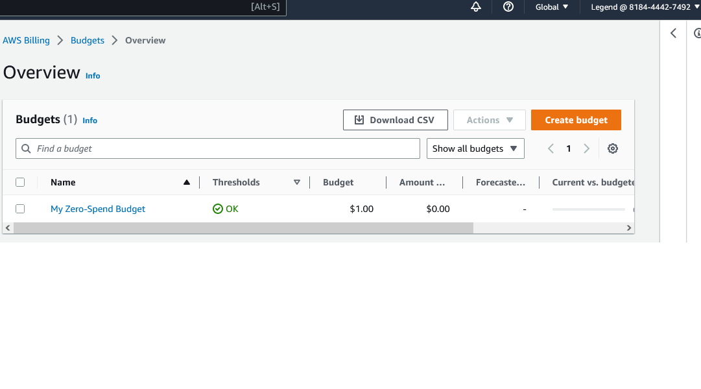

# Week 0 — Billing and Architecture

## Cruddur Conceptual Diagram using Lucid Charts

I managed to design the conceptual diagram and included the key features

The following is a link of the conceptual diagram:

[Lucidchart link] (https://lucid.app/lucidchart/44fbd40c-4e88-4d01-9330-4d71627da570/edit?viewport_loc=-544%2C-846%2C2294%2C954%2C0_0&invitationId=inv_96cce2bd-e386-44ac-b7c0-c43565e587b6)

## Installing AWS CLI

## Proof AWS CLI is working 

## Budget Alarm

