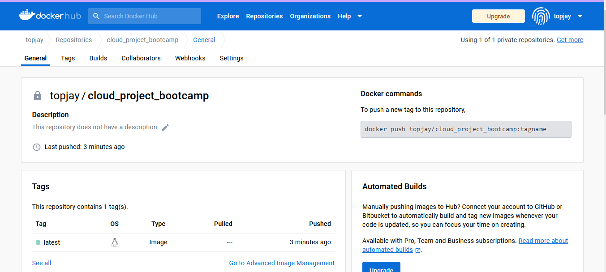
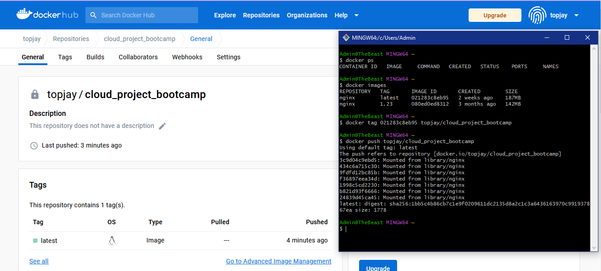
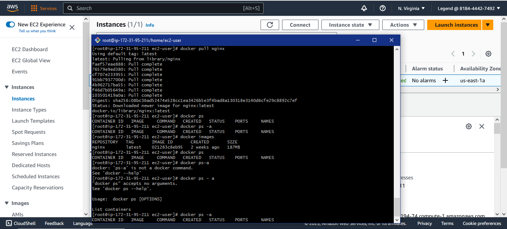

# Week 1 — App Containerization

## Installed Docker Desktop, pulled nginx image from DockerHub, then run containers

## Pushed and tagged an image to DockerHub

## Evidence for image tag and push

## Launched an EC2 instance that has docker installed

