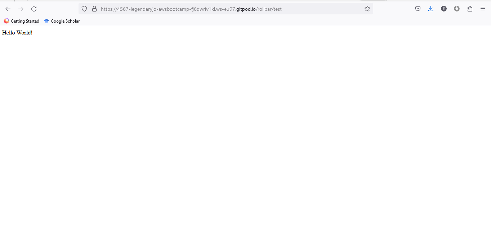
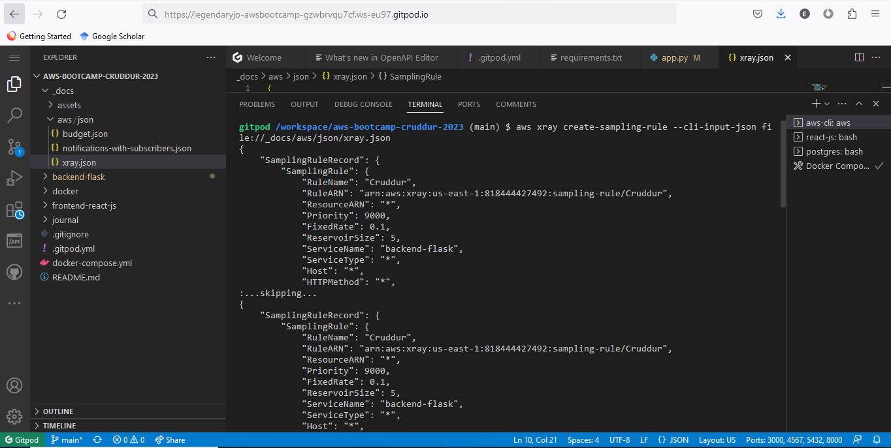
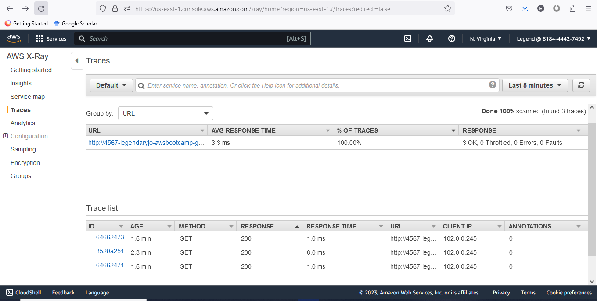
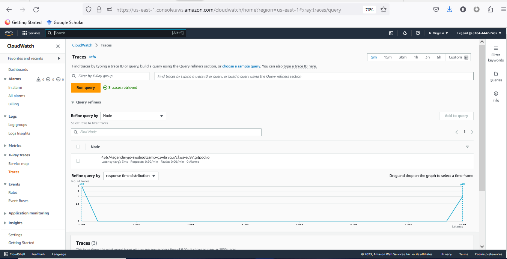
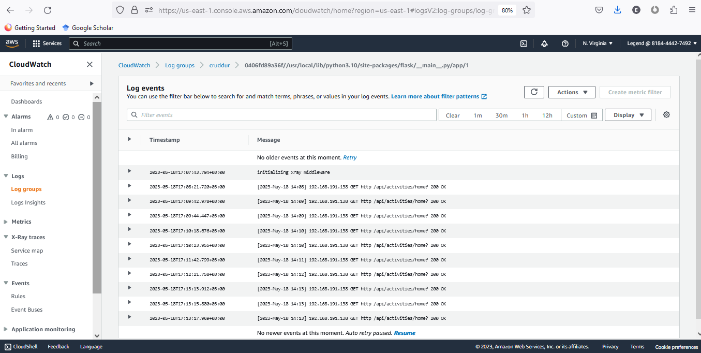
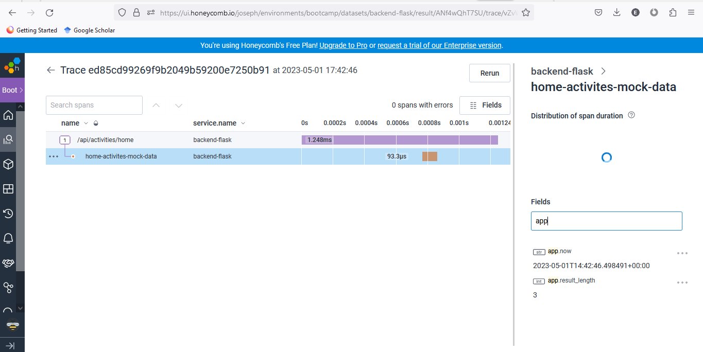

# Week 2 — Distributed Tracing

## Integrated Rollbar for Error Logging

## Creating an X-Ray sampling rule using the AWS CLI and observed the traces

## Instrument AWS X-Ray into backend flask application and got traces

## Managed to run queries for X-Ray traces

## Implemented Cloudwatch logs and got logs

## Run queries and got traces from Honeycomb.io

