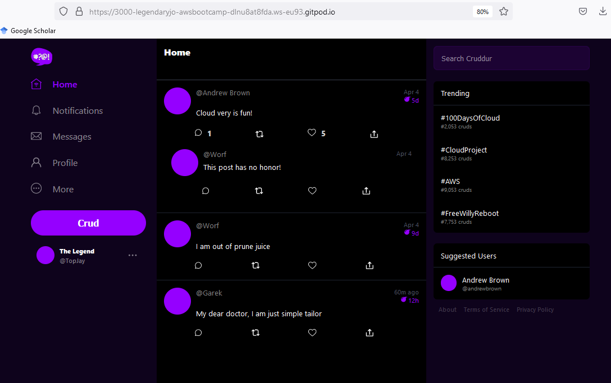
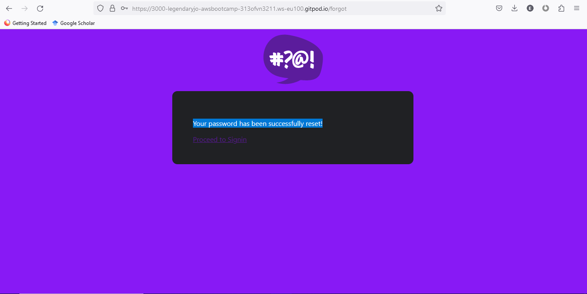
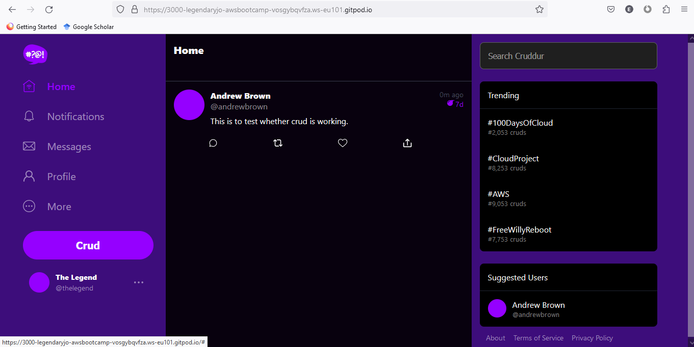

# Week 3 — Decentralized Authentication

## Managed to sign up and sign in to the crud app through AWS Cognito

## Successfully managed to reset password, I made a password forgot request, and got a code which I used to reset the password. 

## Tested and confirmed that seed data was working. 

