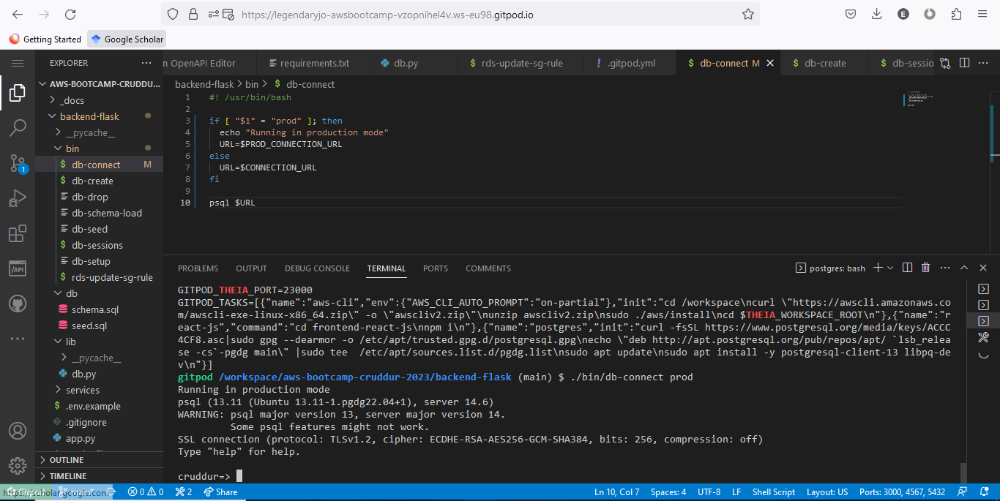
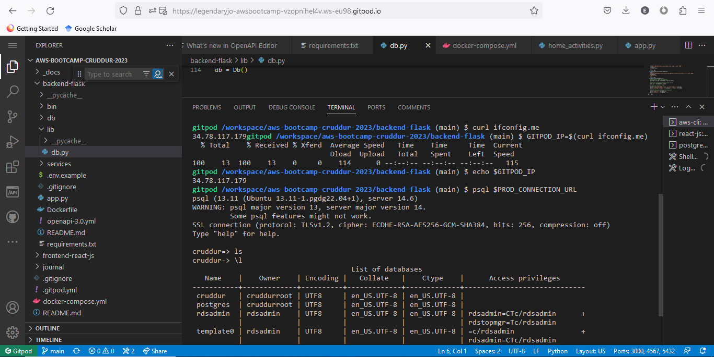
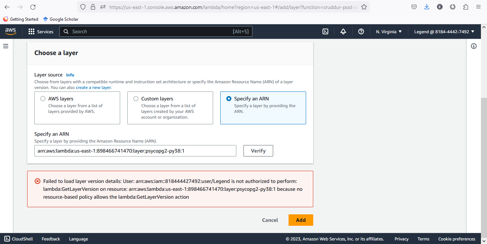

# Week 4 — Postgres and RDS

## I managed to connect to the PostgreSQL prod database using the db-connect script 

## Managed to connect to the prod database using the PROD_CONNECTION_URL and list databases

## Encountered an error, as shown below, when creating a lambda function but followed through and included the script to update security groups to resolve the issue.

## Seeded data into the prod database

![Data (assets/ week-4-seeded-data.PNG)
